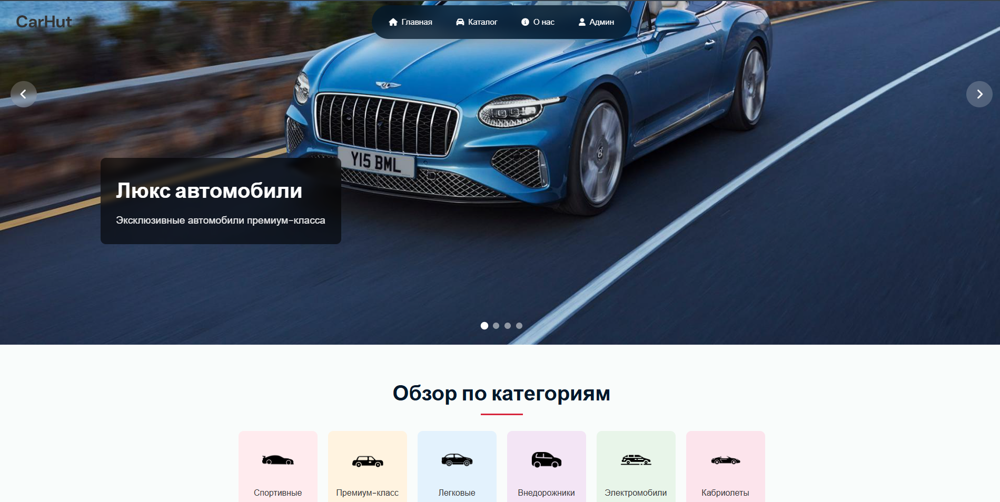
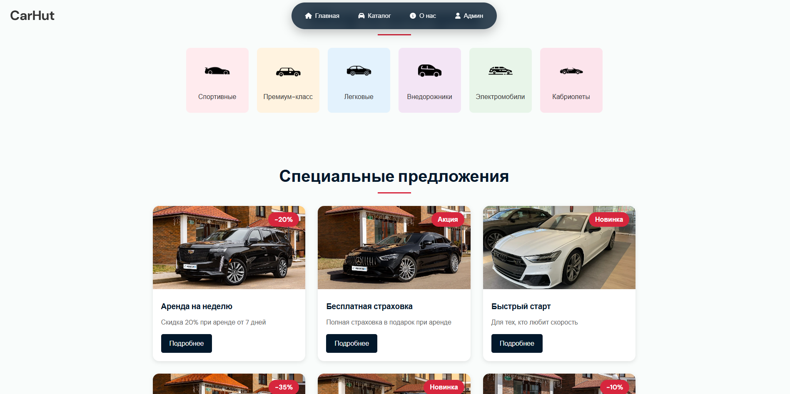
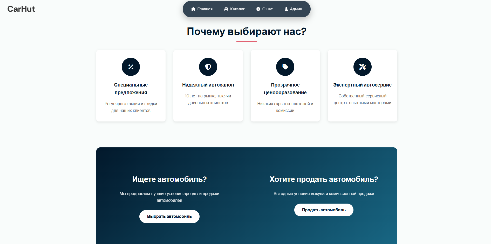
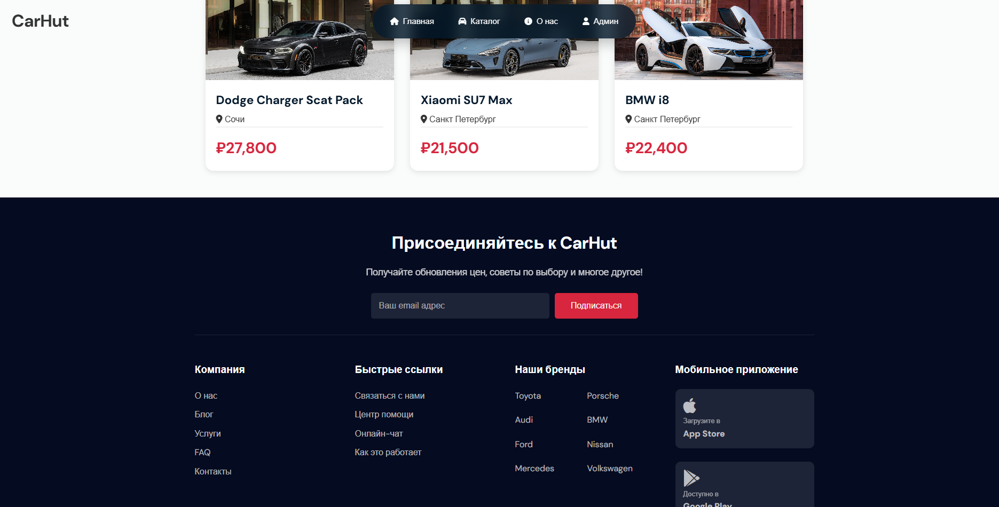
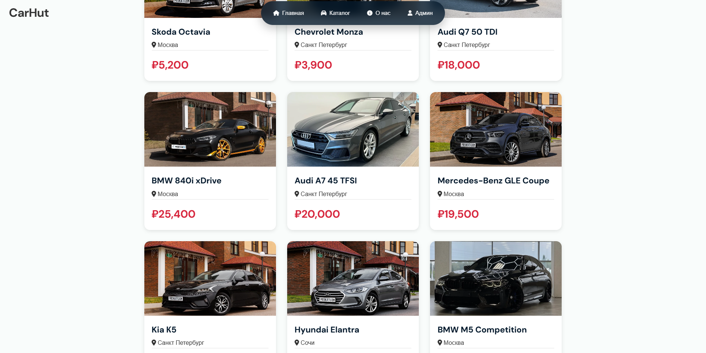
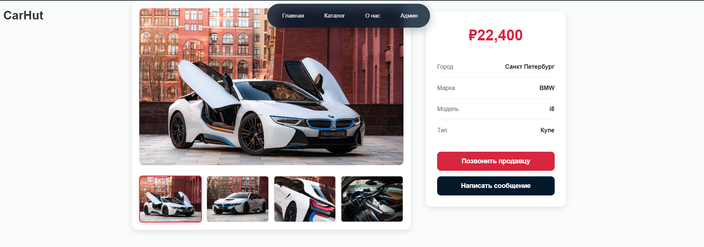
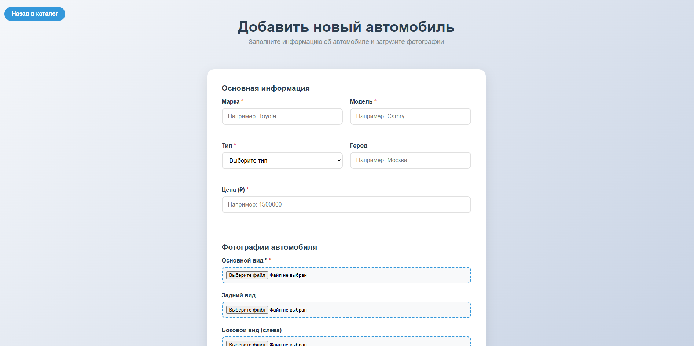

# CarHut - Платформа аренды автомобилей

## Описание проекта 

Веб-сервис для аренды автомобилей, предоставляющий удобный интерфейс для поиска, бронирования и управления арендой транспортных средств. 
Платформа для покупателей автомобилей и арендаторов, предлагая условия и выбор авто.
---

### Технологии
*Backend:*
* Java 17+

* Spring Boot

* Spring MVC

* Thymeleaf (шаблонизатор)

* JDBC / Spring JDBC

* PostgreSQL 

*Frontend:*

* HTML5, CSS3 (Flexbox, Grid)

* JavaScript (Vanilla)

* Font Awesome (иконки)

* Google Fonts

---

# Скриншоты интерфейса
### *Навигация и главная страница*

### *Каталог автомобилей*

### *Детальная страница*

### *Добавление авто*
